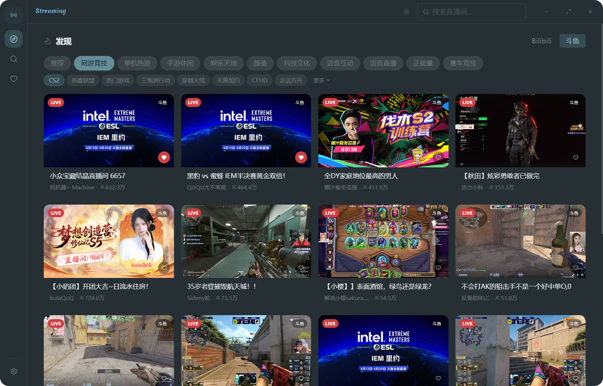

  

<h1 align="center">Streaming</h1>

跨平台直播桌面客户端

  

## 功能

- **多平台直播** -- B站、斗鱼、虎牙
- **直播回放** -- 斗鱼全量录像、B站授权剪辑
- **智能线路** -- 多 CDN 自动择优，画质自由切换
- **收藏同步** -- 跨平台关注列表统一管理
- **轻量高效** -- 极低资源占用，极小包体

## 安装

[Releases](https://github.com/crayonlu/Streaming/releases) 下载对应平台安装包。

## License

[MIT](LICENSE)
